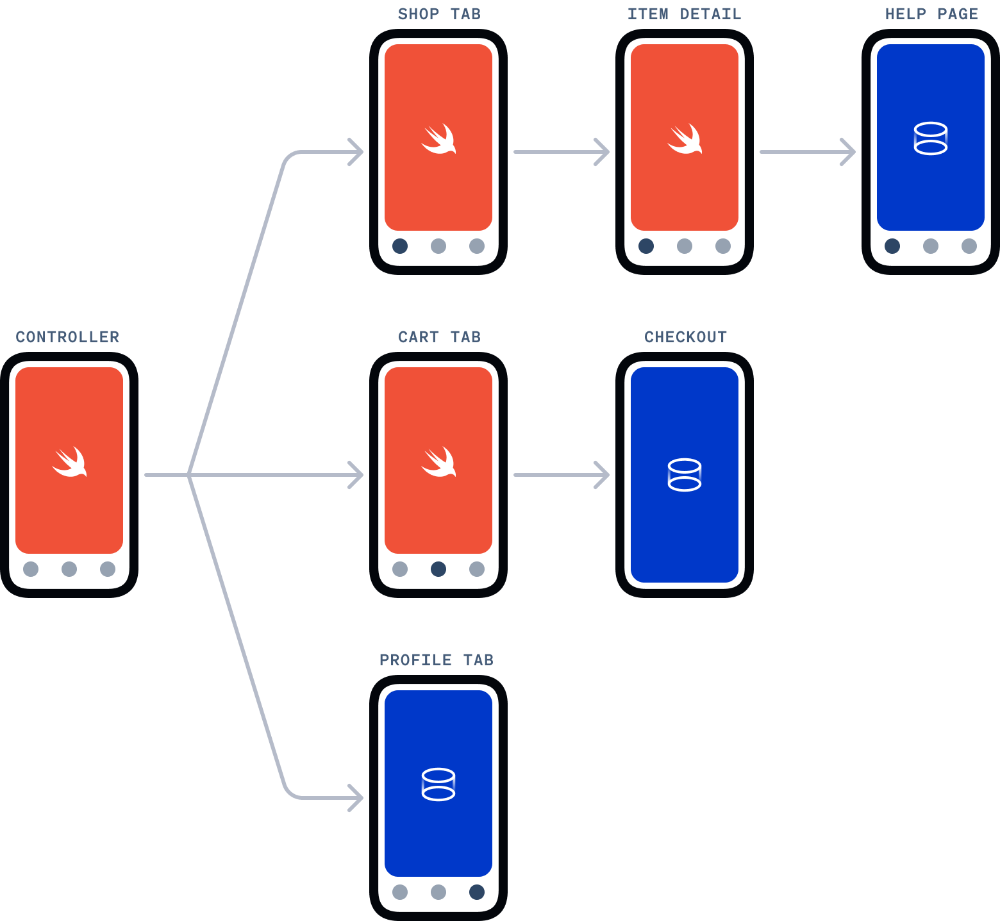

# Portals Ecommerce

An e-commerce demo application using Ionic Portals in a native iOS and native Android application.

This project highlights the use of web resources to populate Portals within native mobile applications, communication between native layers and web resources, and using Live Updates to update the contents of a Portal.

To do so, this project contains applications for both web and native layers.

Native applications are located in the following directories:

- `android`
- `ios`

Two web applications populate Portals within the native mobile applications, located within the `web` directory:

- `web/shopwebapp` - This folder contains an Ionic React application.
- `web/live-updates` - This folder contains a base version of web resources to be replaced using Live Updates.

You can find the un-minified source code for `web/live-updates` in this repository: [Ionic Customer Success Demo: Portals Live Update Micro Frontend](https://github.com/ionic-team/cs-portals-ecommerce-featured-products).

## Portals Registration Key

To try this demo, you are required to input a Portals registration key. You may get a key by going to [ionic.io/register-portals](https://ionic.io/register-portals). Follow the instructions below to add your key to the native demo applications.

### iOS

Create a `Config.xcconfig` file within the `ios/PortalsEcommerce` folder containing the following contents:

```bash
PORTALS_API_KEY=YOUR_KEY_HERE
```

Replace `YOUR_KEY_HERE` with your key.

### Android

Create a `secrets.xml` file within the `android/app/src/main/res/values` folder containing the following contents:

```xml
<?xml version="1.0" encoding="utf-8"?>
<resources>
    <string name="portals_api_key">YOUR_KEY_HERE</string>
</resources>
```

Replace `YOUR_KEY_HERE` with your key.

## Running the Applications

Before running either the iOS or the Android application, you must first build the `shopwebapp` web application:

```bash
cd web/shopwebapp
npm install
npm run build
```

You can run either iOS or Android application once `shopwebapp` has been built. The `web/live-update` folder already contains built web resources to copy into native applications.

## General Architecture

The following diagram represents which application views are written natively and which views display web resources through Portals.

<br />
<div align="center">
  
</div>
<br />

The Swift logo is representative of any native mobile language: Swift, Objective-C, Java, Kotlin, etc.

### Portal Definitions

You can find definitions for each Portal used in the project within the following files:

- **iOS** - `/ios/PortalsEcommerce/Extensions/Portal+Definitions.swift`
- **Android** - `TODO`

### Communication Between Layers

This project uses both [the Portals plugin](https://ionic.io/docs/portals/choosing-a-communication#the-portals-plugin) and [a custom Capacitor plugin](https://ionic.io/docs/portals/choosing-a-communication#capacitor-plugins) to communicate between the native and web layers.

You can find the definition of the customer Capacitor plugin (`ShopAPIPlugin`) within the following files:

- **iOS** - `/ios/PortalsEcommerce/Plugins/ShopAPIPlugin.[swift|m]`
- **Android** - `TODO`

The Portals plugin is intended for small UI tasks, and is used to dismiss a native modal. Use of the Portals plugin can be found in the following files:

- **iOS**
  - `/ios/PortalsEcommerce/Views/Cart/Cart.swift`
  - `ios/PortalsEcommerce/UIKit/ReloadablePortalUIView.swift`
- **Android** - `TODO`

### Live Updates

The `featured` Portal is displayed in the native applications in an interstitial fashion as part of the shopping experience, within the "Shop" tab.

Pressing the refresh icon on the top-right of the Portal pulls down the latest Live Update for the `featured` Portal.

The code for this interstitial experience can be found within the following repo: https://github.com/ionic-team/cs-portals-ecommerce-featured-products/.

This demo application "manually" applies a Live Update by reloading the Portal.

> **Note:** Ionic recommends applying Live Updates using the default background mode. Manual syncing is implemented solely for **demo purposes**.

Refer to Portals' [Getting Started with Live Updates](https://ionic.io/docs/portals/getting-started/live-updates) for additional information on the Live Update API.

## Copying Web Resources

The native applications copy the contents of `web/shopwebapp/build` and `web/live-updates/build` as part of the build process. These directories contain distribution files for the web applications.

For Android, the build task to copy web assets can be found in `packages/app/android/app/build.gradle`. The task is named `copyWebAssets`.

For iOS, the build task can be found within the "Build Phases" of the "PortalsEcommerce" target. The task is named `Copy Web Assets`.
